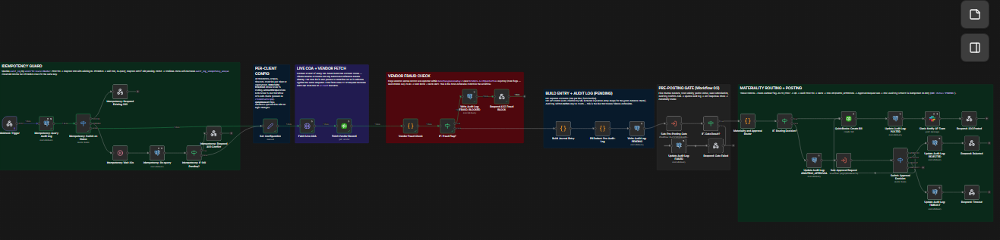
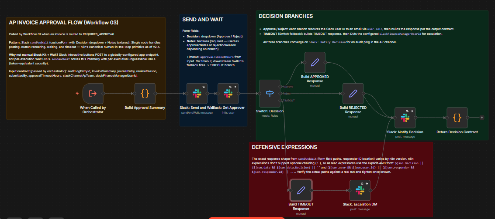
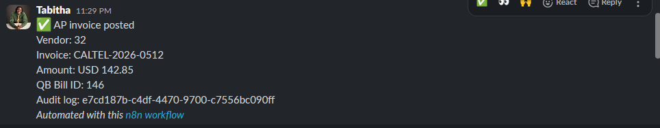
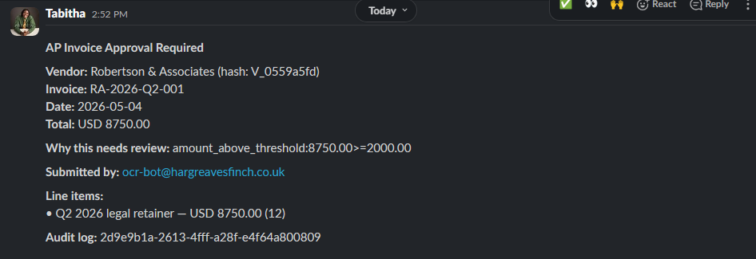
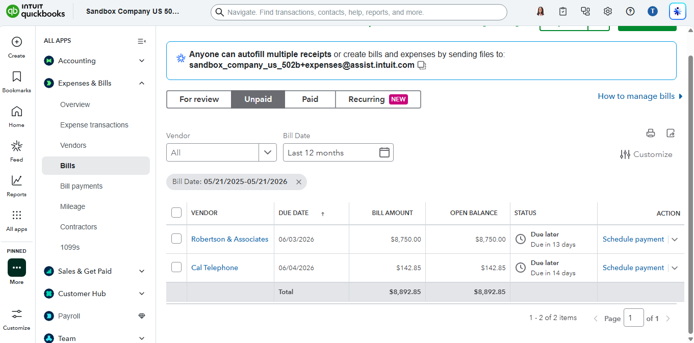
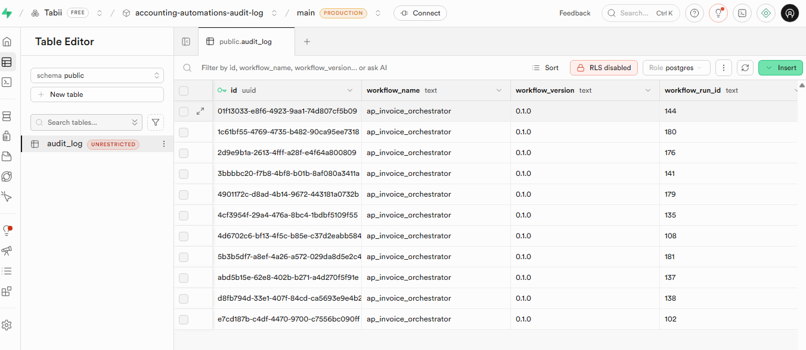

# QuickBooks AP Invoice Automation

A production grade accounts payable orchestrator for SMB finance teams running QuickBooks Online. Five validation checks before any invoice posts to the ledger. Materiality based approval routing through Slack. Immutable audit log on every transaction. Tested across five distinct execution paths.

---

## The five checks that run before any invoice posts

Before any accounts payable invoice in this system can write to the general ledger, five sequential checks have to pass.

The first check verifies that debits and credits balance to two decimal places. The second confirms every account code referenced by the invoice exists in the client's live chart of accounts and is currently active. The third checks whether the accounting period the invoice belongs to is still open in QuickBooks. The fourth verifies that the user submitting the invoice has authorisation to post to those specific accounts. The fifth confirms that a pending audit log entry was written before any of this happened, which is what makes the trail defensible if an auditor ever asks.

If any check fails, nothing posts to QuickBooks. The audit log gets updated with the failure reason. The upstream system receives an HTTP 422 with a structured body explaining what went wrong and why.

This is what I mean when I say compliance aware automation. It is not certified, it is not audited by me, but it is designed so that the controls an auditor would want to see are actually there. Your accounting firm still signs the returns. My job is to make sure nothing slipped past that should not have.

The full Pre Posting Gate workflow:


---

## The problem this solves

Most SMB finance teams I have worked with run accounts payable on Friday afternoons. The controller pulls invoices from a shared inbox, codes them manually, routes approvals through Slack threads or email chains, and posts to QuickBooks one at a time. Mistakes happen: an invoice gets coded to the wrong account, a duplicate gets paid twice, an invoice gets posted to a period that closed yesterday.

The available solutions are either too expensive or too generic. Enterprise platforms like Bill.com and Tipalti charge per user, per transaction, and assume you have an AP clerk and a procurement function. Most SMB finance teams have neither. Generic automation builders, Zapier or Make, can string the integrations together but rarely understand what an audit trail needs to look like, why three way match matters, or what a pre posting validation gate is.

This workflow sits in the gap. It uses the tools an SMB already pays for, QuickBooks Online, Slack, a database for audit logging, and stitches them together with logic that respects how accounting actually works. The client owns the workflow. There is no per user fee. When my engagement ends, the system stays.

---

## Who this is for, and who it is not

This workflow is built for:

A growing SMB with a controller running QuickBooks Online, processing somewhere between 50 and 500 AP invoices a month, and an in house finance team of two to five people.

A fractional CFO supporting multiple SMB clients, looking for an automation pattern that can be redeployed across the portfolio without rebuilding from scratch each time.

A small accounting firm whose clients run on QuickBooks Online and who want to offer AP automation as a recurring service tier.

This workflow is not the right fit for:

Enterprises on NetSuite, Sage Intacct, or SAP. The pattern transfers but the implementation does not.

Businesses processing 5,000+ invoices a month. At that scale you want a dedicated AP platform, not a custom workflow.

Anyone who wants the workflow to make accounting judgements without human oversight. Material entries always require a human in the loop here, and that is a feature, not a constraint.

---

## What the workflow does

The system is three workflows working together, plus an error notifier as a safety net.

**Workflow 01: AP Invoice Orchestrator.** The main entry point. An invoice arrives via webhook, typically from an upstream OCR or intake system. The orchestrator runs idempotency checks against the audit log, fetches the vendor record and live chart of accounts from QuickBooks, runs a fraud check on the vendor's bank details, builds the journal entry, redacts PII before any external call, writes the audit log row in PENDING state, then hands off to the Pre Posting Gate.

**Workflow 02: Pre Posting Gate.** The five check validation layer described above. It returns PASS or FAIL with a specific failure reason. The orchestrator routes on that result.

**Workflow 03: Approval Flow.** Triggered when the materiality router decides an invoice needs human approval. Posts a Slack interactive message to the AP team channel with Approve and Reject buttons. Waits for the human decision with a configurable timeout. Returns the decision back to the orchestrator, which then either posts to QuickBooks or rejects the invoice.

**Workflow 99: Error Notifier.** Catches any unhandled error in the other three workflows, writes a structured row to the error log table in Supabase, fires a Slack message to the engineering channel, and sends an email backup. Wired to all three primary workflows via n8n's Error Workflow setting.

The full orchestrator graph, end to end:



The approval flow handling APPROVED, REJECTED, and TIMEOUT outcomes:



---

## The five tested paths

The workflow has been tested end to end across five distinct execution paths against a real QuickBooks sandbox. Each path exercises a different decision tree in the orchestrator. The audit log captures every run, which means every test is verifiable, not just claimed.

### Path 1: Auto post (happy path)

A $142.85 telephone invoice from Cal Telephone arrives via webhook. The vendor exists, the account code is in scope, the amount is under the materiality threshold, and the period is open. The orchestrator runs all checks, posts the bill to QuickBooks, writes POSTED to the audit log, and fires a Slack notification to the AP team channel. Total round trip under 90 seconds.



### Path 2: Approval required

An $8,750 quarterly legal retainer from Robertson & Associates arrives. The amount exceeds the materiality threshold and the invoice is not in the approved templates list. The orchestrator routes to the approval flow, which posts a Slack message to the AP team with the invoice details and Approve/Reject buttons.



A human clicks Approve. The decision routes back to the orchestrator. The bill gets posted to QuickBooks. The audit log moves from AWAITING_APPROVAL to POSTED with the approver's identity recorded.

### Path 3: Idempotent retry

The same Cal Telephone invoice from Path 1 is resent. The idempotency check finds the original POSTED row in the audit log and returns HTTP 200 with the original QuickBooks Bill ID. No duplicate posts to QuickBooks. The upstream system sees a successful response and knows the work was already done.

### Path 4: Authorisation failure

An invoice is submitted with an expense account code that the AP user is not authorised to post to. The Pre Posting Gate's authorisation check fails. Nothing posts to QuickBooks. The audit log row moves to FAILED with failed_check set to "authorisation". The upstream system receives HTTP 422 with the specific reason.

### Path 5: Chart of accounts failure

An invoice references account code "9999" which does not exist in the client's chart of accounts. The Pre Posting Gate's COA validity check fails. Nothing posts. Audit log row is FAILED with failed_check set to "coa_validity". HTTP 422 returned.

The execution history showing the test runs:


The QuickBooks Bills list, showing the bills that did post (paths 1 and 2):



The audit log in Supabase, showing every run:


---

## The simplification story (v0.1 to v0.2)

The first version of this system was six workflows and roughly 114 nodes. Duplicate detection ran as its own sub workflow with both hard and soft duplicate logic. Three way match against purchase orders had its own workflow. A review queue lived in a separate database table with its own state transitions and a dedicated Slack notification flow for items requiring human attention.

The second version is three workflows and roughly 56 nodes. The six workflow architecture got cut in half, and the compliance controls stayed identical.

That cut was deliberate, and it is the engineering decision I am most willing to defend in this case study.

The first version was, honestly, overengineered for the actual use case. I had drifted into building enterprise grade scaffolding around an SMB problem. A 50 person finance team processing 200 invoices a month does not need three way match against purchase orders unless they have a PO process to begin with, and most do not. They do not need a database backed review queue: when an invoice gets flagged, the controller looks at it in Slack and decides what to do, that is the whole process. Soft duplicate detection (same vendor, same amount, within seven days) catches very few real duplicates and produces false positives that erode trust in the system.

So I cut. The duplicate check collapsed from a sub workflow with both hard and soft logic into a single inline idempotency check at the top of the orchestrator. Three way match got removed entirely, with a note that it can be added back per client when there is an actual PO process. The review queue got replaced by a single Slack notification to the AP team channel. The QUERY decision branch in the approval flow (a third response option beyond Approve and Reject) got cut because it added a whole feedback loop that real approvers rarely use.

What stayed: every compliance control. The Pre Posting Gate (untouched). The audit log writes before and after every action. The materiality based approval routing. The fraud check on vendor bank changes. The PII redaction before any external call. The idempotency guarantee. The retry logic on every external call. The structured error responses on every exit path.

The cut is the work. Most automation builders ship the first version. The discipline is in deleting half of it after you see what is actually load bearing.

If you are evaluating an automation builder, ask them what they cut from the last system they built and why. The answer tells you whether they think in systems or in features.

---

## Compliance controls preserved

Eleven controls survived the cut. Every one is named below with what it does and where it lives.

| Control | What it does | Where it lives |
|---|---|---|
| Idempotency guard | Prevents duplicate posting on webhook retries. Returns HTTP 200 with original Bill ID if invoice was already POSTED. | WF01 (orchestrator), top of flow |
| Pre Posting Gate | Five sequential checks: balance, COA validity, period status, user authorisation, audit log integrity. Fails fast with specific reason. | WF02 (gate), dedicated sub workflow |
| Audit log (PENDING write) | Immutable row written before any GL touch. Append only enforcement via Postgres trigger. | WF01 → Supabase audit_log table |
| Audit log (state transitions) | Explicit UPDATE with WHERE status IN (...) clauses. Never blind writes. Final states: POSTED, FAILED, REJECTED, TIMEOUT, BLOCKED. | WF01 → Supabase audit_log table |
| PII redaction | Vendor names hashed (SHA 256, first 8 chars) before audit log and Slack writes. Bank fragments masked to last 4. | WF01, Code node before any external write |
| Vendor fraud check | Detects bank detail changes within a configurable window. Fail safe: any error blocks the post. | WF01, between vendor fetch and journal build |
| Materiality based approval routing | Above threshold AND not in approved templates list AND scope check: route to human. | WF01, after Pre Posting Gate |
| Human in the loop approval | Slack interactive form with timeout escalation to finance manager. Three outcomes: APPROVED, REJECTED, TIMEOUT. | WF03 (approval flow) |
| Reversibility | QuickBooks Bill ID written to audit_log.target_record_id on POSTED. Every posting can be traced and reversed by ID. | WF01 → Supabase audit_log table |
| Structured error responses | Every executable path terminates with a defined HTTP response. No silent failures. | WF01, six terminal Respond nodes |
| Retry configuration | Every external call (QuickBooks, Slack, Postgres) configured with retryOnFail, maxTries, waitBetweenTries. | All three workflows |

The control set is what makes this defensible to an auditor. Not the n8n workflow graph, not the Slack integration, the eleven controls. If you are bringing this to a client whose books get reviewed, this is the page to show the engagement partner.

---

## Engineering decisions worth highlighting

A few decisions in this build that are not obvious from the graph but are worth explaining if you are evaluating whether to work with me.

**Idempotency vs duplicate check as a single concern.** Early in the build I had two separate components: an idempotency guard at the top of the orchestrator, and a duplicate detection sub workflow further down. After auditing the logic I realised both were running the same query against the same table with the same key. Two queries, same answer. The idempotency block also produces strictly better return semantics: HTTP 200 with the original Bill ID for legitimate retries (the right answer for an upstream OCR system), versus HTTP 422 which a generic duplicate check would return. Keeping both would have been waste. So one duplicate detector at the top, nothing duplicated mid flow.

**Append only enforcement at the database layer, not the application layer.** The audit log table has a Postgres trigger that blocks UPDATE operations on identity fields (workflow_run_id, action_type, before_state) and blocks DELETE entirely. Only specific status progression fields can change. This means even if a future workflow has a bug that tries to retroactively rewrite an audit log row, the database rejects it. A finance auditor asking "can rows be modified after creation?" gets an answer they can verify in SQL.

**Live chart of accounts fetched per run, not cached.** The orchestrator queries the QuickBooks COA at the start of every invoice processing run. This is slower than caching, by maybe 400 milliseconds per run. The trade is that the gate's COA validity check sees the actual current state of the client's accounts, not a stale copy. SMB clients add and rename accounts; a cached COA would fail every time someone reorganised their books.

**Postgres node over native Supabase node.** The audit log uses raw SQL via the Postgres node, not the Supabase REST API node. The reason is conditional UPDATEs, JSONB type casting, NOW() function calls, and IN clauses, none of which the REST API handles cleanly. The Postgres node gives explicit parameter binding and lets the audit log behave like a real transactional system instead of a CRUD interface.

**HTTP Request to the QuickBooks Query API for COA and Preferences.** The native n8n QuickBooks node does not expose the Account or Preferences resources. They live in QuickBooks' Query API. The orchestrator uses HTTP Request with the QuickBooks OAuth credential to hit the Query endpoint directly. This is the right answer for any QuickBooks integration that needs to read non transactional metadata, and worth knowing if you are building similar.

---

## Stack and deployment

n8n Cloud as the workflow engine. Self hosting works equally well; I built and tested locally before deploying.

Supabase for the audit log database. The `audit_log` table has 27 columns including a JSONB `before_state` and `after_state` for change tracking, append only triggers, and a unique index on `idempotency_key` for race safe duplicate detection.

QuickBooks Online sandbox for the GL integration. The OAuth credential covers reading accounts, vendors, preferences, and writing bills. The same credential works against production QuickBooks with no code changes.

Slack for human in the loop approvals and notifications. The approval flow uses Slack's `sendAndWait` pattern with a custom form, which handles the interactive button rendering, the wait for human input, and the timeout escalation in a single node.

The full source is in this folder:

```
quickbooks-ap-invoice-automation/
├── workflows/
│   ├── 01-ap-invoice-orchestrator.json
│   ├── 02-pre-posting-gate.json
│   ├── 03-approval-flow.json
│   └── 99-error-notifier.json
├── samples/
│   ├── orchestrator-happy-path.json
│   ├── orchestrator-over-threshold.json
│   ├── orchestrator-duplicate.json
│   ├── orchestrator-auth-fail.json
│   └── orchestrator-coa-fail.json
└── screenshots/
```

To run this against your own QuickBooks sandbox: import the four workflow JSON files into n8n, wire your QuickBooks OAuth credential, set up a Supabase Postgres credential pointing at a database with the `audit_log` table schema, set the Slack OAuth credential against a workspace with an `#ap-team` channel, and trigger the orchestrator with one of the sample payloads. The samples reference Craig's Design and Landscaping Services (Intuit's standard sandbox company), so they should work against any QuickBooks developer sandbox.

---

## What I would do differently for a real client engagement

A few things that are sensible for a portfolio build but would change for a paying client.

**Real OCR or invoice intake upstream.** The portfolio version assumes webhook delivery of structured JSON. A real client engagement would need an upstream OCR system (Dext, Hubdoc, Bill.com OCR, or a custom intake), or an email parser that extracts invoice data from PDF attachments. I have the patterns for both, this just was not the scope here.

**A `vendor_id_hash` column on the audit log.** The current PII redaction hashes the vendor name on each write but stores it inline in the `notes` column. A cleaner pattern is a dedicated `vendor_id_hash` column, which makes downstream queries by vendor faster and cleaner. I noted this in the simplification report as a v3 improvement.

**A reverse posting workflow.** The audit log captures the QuickBooks Bill ID on every POSTED row, which makes reversal possible. But there is no workflow that actually issues the reversal yet. For a real client this would be Workflow 04: takes an audit log ID, fetches the original Bill, issues the credit memo, and writes a REVERSED row to the audit log linking back to the original.

**Per client configuration management.** The current Set Configuration node holds materiality thresholds, approved templates, account scope, and timeout values inline. For a multi client deployment (fractional CFO or accounting firm running this across a portfolio), these would move to a per client config table in Supabase, queried at the start of each run.

**Production monitoring.** The error notifier handles unhandled errors, but a real client would want positive monitoring: alerts when no invoices have been processed in 48 hours, alerts when the failure rate exceeds a threshold, weekly summary reports of what got posted versus what got flagged. The patterns are simple; I just have not built them here.

---

## Working together

If this is the kind of system your business or your client needs, the fastest way to know whether I am the right person to build it is a 30 minute scoping call.

On the call:

I will map the AP process end to end from invoice arrival to GL posting. We will identify the bottlenecks worth automating and the ones that probably are not. I will tell you whether a custom n8n build is the right answer for your situation, or whether you should buy something off the shelf and route around the gaps. If it is not the right fit, I will say so on the call and point you to whoever is.

Engagements come in three shapes:

**Fixed price pilot.** One well scoped process from kickoff to production. Two to six week timeline depending on integrations. Includes the control map, the runbook, and a 30 day support window after go live.

**Retainer.** For finance teams or fractional CFOs running multiple workflows in production. Monthly retainer covers maintenance, schema changes when your chart of accounts evolves, and a small allowance for new builds.

**Audit and improvement.** For teams that already have automation in place but suspect it is not as defensible as it should be. I review your current workflows, write up what works, what does not, and what specifically needs to change for compliance.

Pricing depends on scope and I do not publish standard rates because the right number depends on your situation. I do not sell hours and I do not sell seats. I sell working systems.

**Contact:**

- Upwork: [tabitha-eoke on Upwork](https://www.upwork.com/freelancers/~01954f73840469cae5)
- LinkedIn: [linkedin.com/in/tabitha-oke-n8n](https://www.linkedin.com/in/tabitha-oke-n8n)
- Email: tabithaeoke@gmail.com

I respond within one business day. If you have a brief already written, send it over and I will come to the call with questions, not a sales pitch.

---

## License

MIT License. The workflows and code in this case study are published as portfolio pieces, free to read, fork, and learn from. Production deployment in a client engagement requires a direct engagement so the configuration, security, and compliance posture can be tailored to the client's specifics. See `../LICENSE` for the full license terms.
