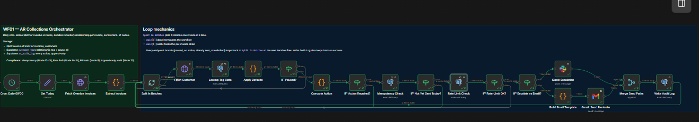
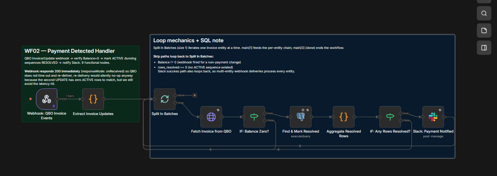
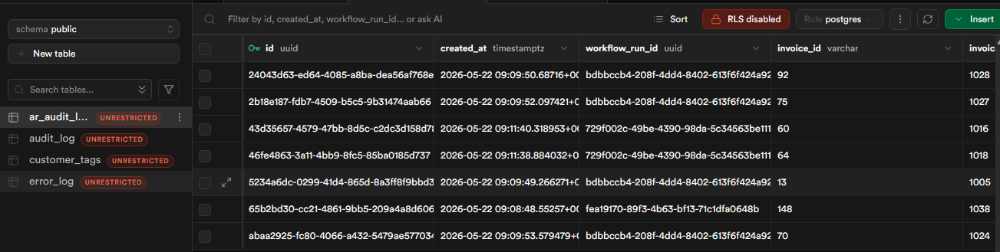
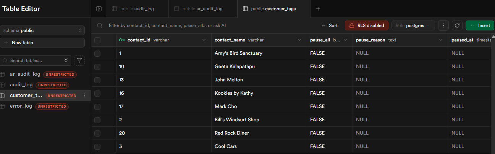
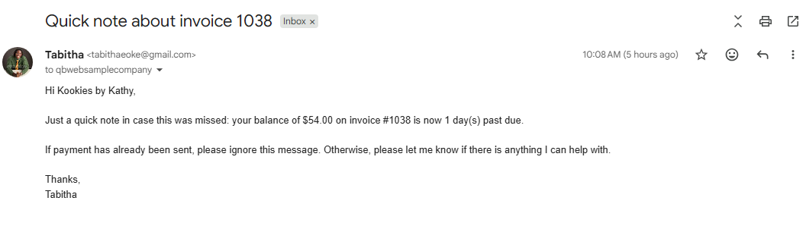
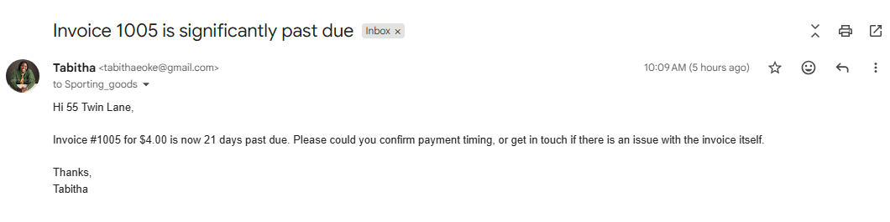
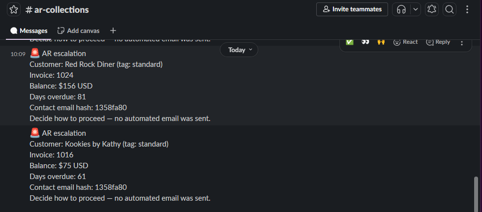
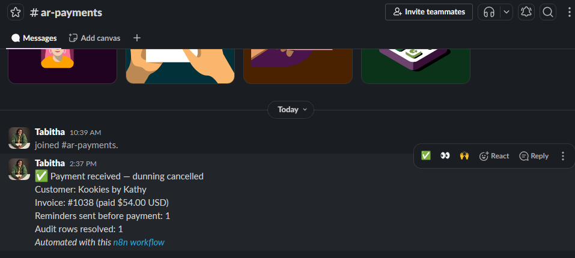
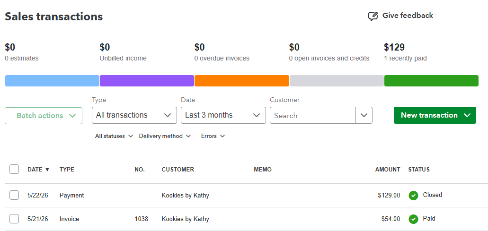

# AR Collections Agent — QuickBooks Online

**Built for SMB founders who are tired of being their own collections department.**

Status: Shipped. Tested end-to-end against a live QuickBooks Online sandbox. Five execution paths verified. Real audit trail, real emails, real Slack notifications. [Skip to the evidence](#what-actually-runs).

---

## The problem this solves

You sent the invoice. The customer didn't pay. Now your week looks like this: open QuickBooks, run the AR aging report, scan for anything over 30 days, draft a reminder email, send it, copy yourself, log it somewhere, repeat for the next overdue invoice, and try not to forget to follow up in two weeks if they still don't pay.

This is the workflow nearly every small business owner I've spoken to runs manually. The numbers around it are ugly: nearly 90% of businesses report that around 30% of invoices are paid late. For companies extending payments beyond 30 days, an average 4.6% of revenue is lost to payment uncertainty. The chasing is the work, and the chasing doesn't earn you anything; it just protects what you already earned.

Bigger companies solve this with HighRadius, Versapay, or Chaser. Those are good products. They also charge per user, per transaction, and assume you have an AR clerk. If you're an SMB founder doing AR yourself between actual customer work, you don't need an enterprise AR platform. You need the chasing to happen without you, in your voice, with rules you can read in plain English, and a way to know what your automation said to which customer when.

That's what this builds.

---

## What it does, in one sentence

When an invoice goes overdue in QuickBooks Online, the system sends polite, personalised reminders on a defined schedule, escalates anything still outstanding at 60 days to the owner via Slack, detects when payment arrives, and cancels the rest of the sequence automatically.

## What it does not do

- It does not call customers, send SMS, or use WhatsApp. Email only.
- It does not apply payments to invoices. QuickBooks does that natively when the bank feed clears.
- It does not write off invoices, change terms, or make credit decisions.
- It does not auto-generate email copy with an LLM. Templates are deterministic with merge fields, so what your customer sees is what you'd write yourself.
- It does not analyse customer sentiment. If a customer replies, a human takes over.

The discipline here is deliberate. SMB AR automation that quietly does too much is how you end up emailing a customer about an invoice they already disputed by phone.

---

## How it works

Two production workflows plus a shared error notifier. About 30 nodes total across both. Self-contained, no external dependencies beyond the tools you already pay for.

### Workflow 01: AR Collections Orchestrator

Runs daily on a cron. Fetches every overdue invoice from QuickBooks. For each one, the workflow:

1. Pulls the customer record and relationship tag (standard / long-term-trusted / new) from a small Supabase table you manage.
2. Checks whether the customer is on a global pause (e.g., they're disputing something and shouldn't be chased on anything).
3. Computes days overdue against the invoice's due date.
4. Decides the action based on the schedule below.
5. Checks the audit log to confirm we haven't already sent this exact reminder today (idempotency).
6. Checks the customer hasn't already received two reminder emails in the past seven days (rate limit).
7. Sends a templated email via Gmail, posts an escalation to Slack, or exits silently if no action is due.
8. Writes a row to the immutable audit log recording what was decided and what was done.

The dunning schedule for standard-tier customers: reminder 1 at day 1, reminder 2 at day 7, reminder 3 at day 21, reminder 4 at day 45, escalate to owner at day 60+. Long-term-trusted customers get a gentler schedule (day 14, day 35, escalate at day 60). New customers follow the standard track.

### Workflow 02: Payment Detected Handler

Triggered by a QuickBooks webhook on Invoice updates. When an invoice's balance drops to zero, the workflow:

1. Fetches the invoice to confirm balance really is zero (webhooks fire on many kinds of update; we verify before acting).
2. Looks up any ACTIVE dunning sequences for that invoice.
3. If sequences exist, marks them all RESOLVED in a single UPDATE, posts a quiet confirmation to Slack.
4. If no sequences exist (the invoice was paid before we ever chased it), exits silently. No noise for the things that worked.

---

## Compliance controls baked in

This is where ACA training shows up. Eleven controls, lighter than the AP Invoice Orchestrator's because AR doesn't touch the general ledger, but the same posture:

1. **Idempotency guard.** A unique index on `(invoice_id, sequence_step, UTC date)` means running the workflow twice in one day sends one email, not two.
2. **Append-only audit log.** Postgres trigger blocks DELETE entirely and blocks UPDATE on identity fields. Status changes are allowed (that's how WF02 marks rows RESOLVED), but the original action record is immutable.
3. **PII redaction.** Customer email addresses are hashed to an 8-character prefix before persistence. The raw email is used to send the message and never written to Supabase.
4. **Per-customer rate limit.** No customer receives more than two reminders in any rolling 7-day window across all their invoices. Prevents the "three overdue invoices = three emails on the same morning" failure mode.
5. **Per-sequence pause.** Owner can mark any specific dunning sequence as PAUSED via the audit log. Workflow respects it.
6. **Per-customer pause.** Owner can mark any customer with `pause_all = TRUE` via the customer_tags table. Workflow skips them entirely until cleared.
7. **Reply detection.** If a customer replies to a reminder, the owner sees the reply in Gmail and manually pauses the sequence. No automated reply parsing in v1 — that's a v2 feature once we have enough conversation data to train against.
8. **Retry configuration.** Every external call (QuickBooks API, Gmail, Slack, Supabase) has retryOnFail with three retries and exponential backoff.
9. **Structured Slack escalations.** Owner gets full context for 60+ day overdue invoices: customer name, balance, days overdue, last contact, relationship tag.
10. **Untagged-customer safety.** Customers without an assigned relationship tag default to "standard" rather than erroring. Means you can onboard new customers in QuickBooks without breaking the workflow.
11. **Workflow-run UUID.** Every audit row carries a UUID identifying the workflow run that wrote it. If something goes wrong at 3am, you can trace every action back to the exact execution.

---

## What actually runs

Five execution paths tested end-to-end against Craig's Design and Landscaping Services, the QuickBooks Online sandbox company. All five passed. Screenshots below are live evidence, not staged.

### Workflow architecture

*WF01: AR Collections Orchestrator, daily cron, 21 nodes. Notice the loop-back pattern from every early-exit IF back to Split In Batches — per-invoice failures don't abort the whole run.*

*WF02: Payment Detected Handler, QBO webhook, 9 functional nodes. Webhook responds 200 immediately so QuickBooks doesn't time out and re-deliver.*

### Live audit log

*Real audit rows written by WF01 firing against Craig's sandbox. Note the workflow_run_id UUIDs (one UUID per workflow execution, shared across every row written during that run) and the invoice_id values are QuickBooks internal IDs (not DocNumbers).*

### Customer tags

*Eight customers tagged across three relationship tiers. Untagged customers default to "standard" — no manual setup required to onboard new customers.*

### Reminder emails sent

*Day-1 reminder. Note the "balance" language (not "invoice amount") — handles partial payments cleanly because the same template works whether the invoice is fully unpaid or partially paid.*

*Day-21 reminder, firmer tone, still in the owner's voice. This one went to a partially-paid invoice where $4 was outstanding from an original $54.*

### Escalations to Slack

*60+ day overdue invoices escalate to the owner. No automated email is sent at this stage — the workflow flags it and steps back, because at 60 days the right answer is usually a phone call, not another email.*

### Payment detected, sequence cancelled

*Kookies by Kathy paid invoice 1038. Webhook fired, WF02 marked the ACTIVE dunning row RESOLVED, posted confirmation to a separate `#ar-payments` channel. Owner knows the chase ended successfully without scanning their inbox.*

### Verified in QuickBooks

*The same invoice in QuickBooks, status Paid, after the payment was applied via the bank feed. End-to-end loop closed.*

---

## What's deferred to v2

Honest about this list, because vendors who promise everything are the ones SMB buyers learn to distrust.

- **Multi-currency.** USD only in v1. Multi-currency adds FX rate handling and revaluation logic that earns its own scope.
- **SMS / WhatsApp / voice escalation.** Email plus Slack only. Adding channels means adding consent management, channel preference per customer, and quiet-hours logic.
- **Tolerance-based payment matching.** If a customer pays $99 on a $100 invoice, v1 leaves it open. v2 adds a tolerance band.
- **LLM-generated reminder copy with brand voice training.** Templates only in v1. Worth doing later, once we have enough sent-and-replied-to email data to train against.
- **Webhook signature verification.** v1 uses an obscured webhook path. v2 verifies the `intuit-signature` HMAC-SHA256 header.
- **Reporting dashboard.** v1 reporting is direct SQL queries against the audit log. A dashboard with DSO trend, collection rate, and average days outstanding is worth building once there's enough audit data to make trends meaningful.
- **Customer self-service portal.** v2 work, if it earns its place.

---

## The stack

QuickBooks Online (sandbox + production), n8n self-hosted or Cloud, Supabase Postgres, Gmail OAuth for transactional email, Slack for owner notifications. Roughly 30 nodes across the two workflows. Audit log table with append-only Postgres triggers. Reuses the error notifier from the AP Invoice Orchestrator project — one shared notifier across the portfolio because that's how a real ops team works.

If you're on Xero instead of QuickBooks Online, the same architecture transfers; Xero's API surface is different but the workflow patterns and compliance controls don't change. Same applies to Zoho Books, FreeAgent, or any accounting system with a reasonable REST API.

---

## What this would cost to run for you

The honest answer depends on the shape of your AR, but here are the variables:

- **Email volume.** Gmail has free sending limits well above what an SMB needs. If you exceed them, transactional email providers (Postmark, SendGrid) are $10-$30/month.
- **n8n hosting.** Self-hosted on a small VPS is $5-$15/month. n8n Cloud is $20/month for the starter plan.
- **Supabase.** Free tier covers an SMB audit log comfortably. Pro tier ($25/month) if you want backups and longer retention.
- **The build itself.** Fixed-price pilot for a single customer engagement, typically two-to-six weeks depending on the QBO/Xero account shape and how many customer relationship tiers you need.

Total ongoing infrastructure: $25-$70/month, depending on volume. Compare against an AR clerk's time at SMB founder rates and the math is straightforward.

---

## How I worked on this

Two weeks of build time from kickoff to shipped. Worked the same way I'll work on yours:

1. Read the actual QuickBooks API response shape before writing parsing logic. Customer custom fields don't surface in the QBO API the way you'd expect — discovered that on day one, moved relationship tags to Supabase instead of QBO custom fields, avoided a class of bugs.
2. Configured manually for the first week. Tagged customers by hand in Supabase. Ran the workflow against pinned fixtures before running it against live data.
3. One commit per discrete change. If something broke at midnight on day six, the previous green state was always a `git checkout` away.
4. Tested every compliance control deliberately. The append-only trigger was tested by trying to DELETE a row and confirming the database rejected it. The idempotency guard was tested by running WF01 twice in one day and confirming the second run sent zero emails.

---

## Get in touch

If you're an SMB founder, a fractional CFO, or a bookkeeper running AR for SMB clients, and the workflow above looks like it would save you a week of chasing per month, the fastest way to know if I'm the right person to build this for you is a 30-minute scoping call.

I'll map your AR process end to end on the call, tell you whether automation is the right answer, and quote a fixed price if it is. If it isn't, I'll say so.

- **Upwork:** [tabitha-eoke on Upwork](https://www.upwork.com/freelancers/~01954f73840469cae5)
- **LinkedIn:** [linkedin.com/in/tabitha-oke-n8n](https://www.linkedin.com/in/tabitha-oke-n8n)
- **Email:** tabithaeoke@gmail.com

I respond within one business day.

---

*Built by Tabitha Oke, ACA. Workflows are MIT-licensed as portfolio pieces. Production deployment in a client engagement requires a direct engagement.*
