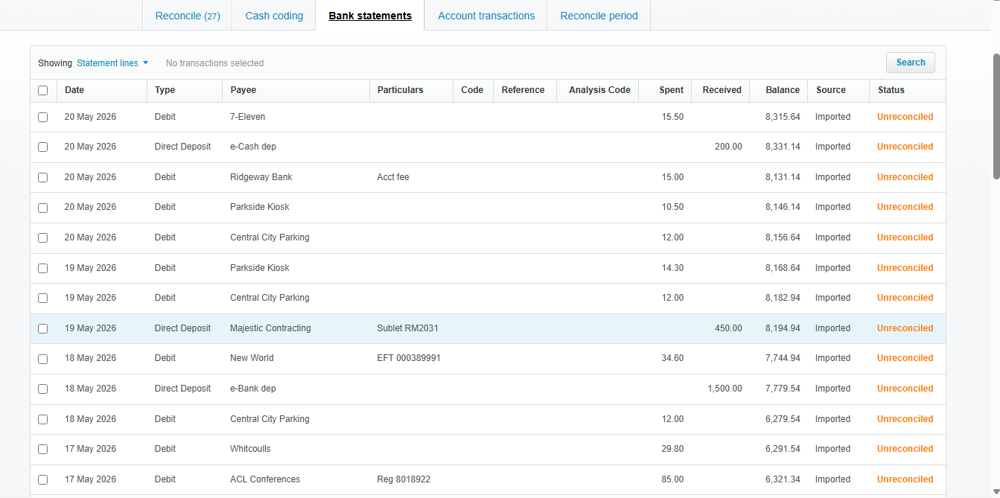
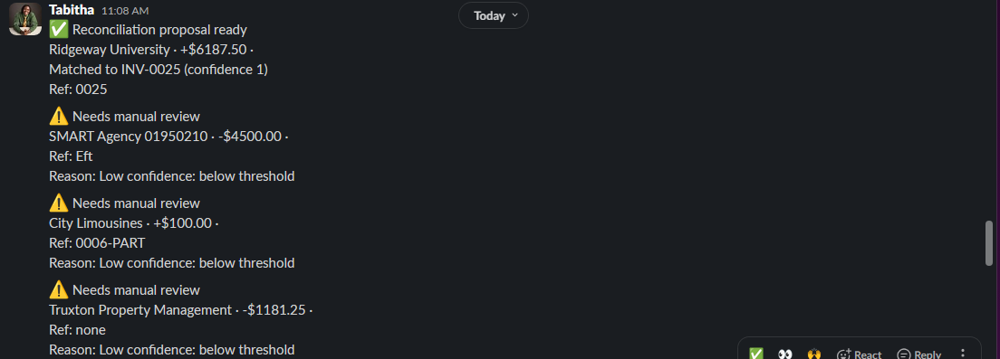
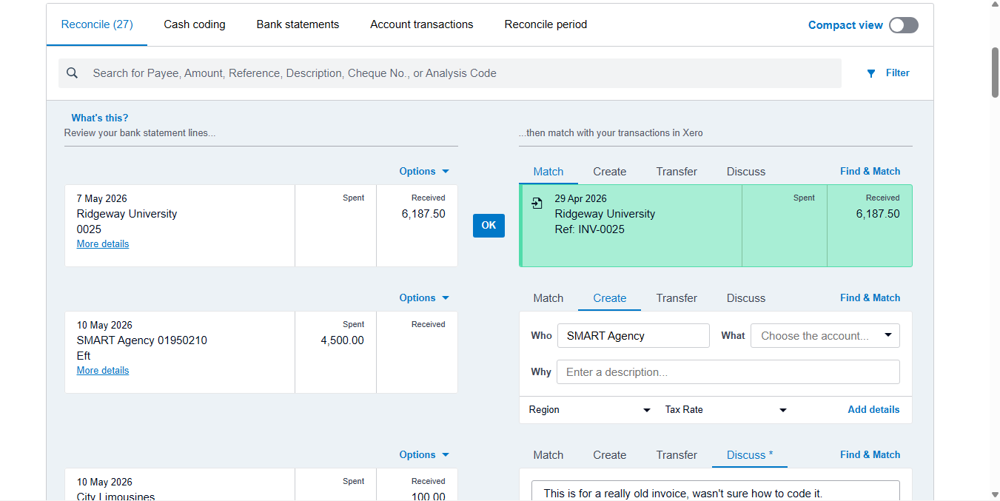
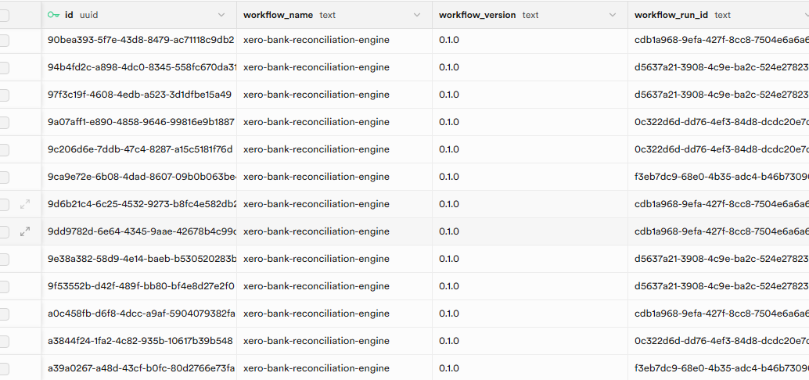
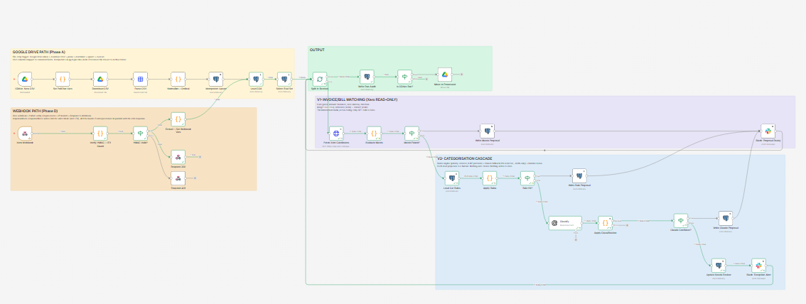

# Xero Bank Reconciliation Engine

**For small business owners staring at a bank feed full of unreconciled lines, wondering which ones the software can actually help with and which ones are on you.**

Every line in your Xero Reconcile tab is a small decision. Some are easy: the invoice already exists, Xero spots it, you click OK. Most are not. The supplier payment with no bill behind it, the deposit that came in before you raised the invoice, the parking charge that needs a category. Xero goes quiet on those, and quiet is where your afternoon goes.

This engine fills that silence. It reads your bank statement, proposes a match or a category for every line, and hands you a queue of decisions instead of a wall of raw transactions. You still click reconcile, because Xero requires that and because the books should always have a human in the final seat. The slow part, working out what each line is, happens before you sit down.

I'm Tabitha. I'm an ACA-credentialed accountant and I build automation that respects how accounting actually works. This is the fourth workflow in the portfolio, built on Xero, and it is a reference build against a Xero demo company, clearly labelled as portfolio work. No client data, no fabricated outcomes.

---

## The problem, in plain terms

A bank feed lands in Xero with dozens of lines a week. Xero's Reconcile tab suggests a match only when a transaction already exists in the ledger that lines up. That covers the easy minority. For everything else, the suggestion area is empty and you are left to remember who the payee is, find the matching invoice or bill yourself, or decide which account the spend belongs to.

That residual is the real work. It is also where mistakes creep in, because the tired human at the end of the month codes a few lines wrong and finds them weeks later when the profit and loss looks off.

The job of this engine is not to replace the reconcile click. It is to remove the thinking that happens before the click.

---

## What it does

The system runs as a single n8n workflow with two ways in.

**A bank statement arrives as a CSV.** A bookkeeper exports it from the bank portal, the same export they already do, and drops it in a Google Drive folder. The workflow picks it up, normalises every line, and stores it once.

**For each line, it tries to match first.** It pulls your open invoices and bills from Xero and checks each candidate against three hard gates: the amount has to be within tolerance, the date has to fall inside the invoice's natural lifecycle, and the direction of money has to agree (money in matches invoices, money out matches bills). Anything that clears all three gets scored on how well the reference text and the contact name line up. A high score becomes a proposed match.

**If no invoice or bill fits, it tries to categorise.** First against a rules table you control: a vendor name or a description pattern maps to a general ledger account. If no rule fits, it asks an AI model to suggest the most likely account from your actual chart of accounts, with a confidence score. If the AI is confident enough, that becomes a proposed category. If it is not, the line goes to a review queue for a human.

**Every outcome lands in Slack** in language a bookkeeper can act on, and every decision is written to an immutable audit log.

*The starting point: 27 imported statement lines, every one unreconciled. This is what the engine reads.*

---

## What happened on a real run

Run against the Xero demo company Clancy, a 27 line bank statement covering two weeks of activity:

| Outcome | Lines | What it means |
|---|---|---|
| Matched to an invoice | 1 | A clean one to one match against an open invoice, proposed automatically |
| Categorised to an account | 15 | No document existed, so the engine assigned a general ledger account via rules or AI |
| Routed to human review | 11 | Genuinely ambiguous, surfaced with context instead of guessed |

The full run took **38.86 seconds**.

Read those numbers honestly. Only three of the 27 lines had any document in Xero to match against, because most of the statement is small operating spend that never gets an invoice or a bill raised against it: parking, a supermarket run, bank fees, a bakery. Those are not matching failures. They are categorisation work, and the engine handled fifteen of them without a human. The eleven in review are there for real reasons, covered below.

*Each proposal speaks the bookkeeper's language. Ridgeway University, plus 6,187.50 dollars, matched to INV-0025. Open Xero, find that line, reconcile.*

When the engine proposes the match, Xero shows the same suggestion on the line and the human confirms it:

*This screenshot is the whole argument for the project. The top line has a green suggestion because the invoice existed. The line below it, SMART Agency, has nothing but a blank Create form, because no record exists for Xero to suggest. The engine proposed an account for that line. Xero did not.*

---

## The honest pivot

This project did not end up where it started, and the reason is worth telling because it is the kind of thing that separates someone who has read the documentation from someone who has not.

The original scope was an engine that auto-reconciled high confidence matches directly in Xero through the API. On day one of the build I confirmed what Xero's own developer guidance states: Xero does not expose unreconciled bank statement lines through the public API, and it does not permit reconciling them through the API either. Bank statement data is treated as regulated banking information and the reconcile action stays inside Xero's interface.

That is a wall, and it is better to hit it on day one than on day five. So the design changed. Instead of pretending to reconcile through an API that forbids it, the engine became a decision engine: it reads the bank feed from a CSV, proposes the match or the category, and leaves the final reconcile click to the human in Xero. The bank feed comes from the export the bookkeeper already downloads, and Xero is used read only, purely to pull the invoices, bills, and contacts the engine matches against.

The pivot made the project more honest and, as it turns out, more sellable. An engine that respects the platform's boundary is one an accountant can trust. An engine that fights the boundary is one that breaks the first time the platform tightens a rule.

---

## How the matching actually works

The matching logic is deliberately conservative, because in reconciliation a confident wrong answer is far more expensive than an honest "I'm not sure."

**Three hard gates, all mandatory.** A candidate invoice or bill has to pass every one of these or it is discarded before scoring:

- **Amount within tolerance.** The difference between the bank line and the document has to be inside the greater of an absolute floor (50 cents by default) or a percentage (0.1 percent by default). The absolute floor matters for small lines, where a percentage alone would be a single cent.
- **Date within the invoice lifecycle.** Rather than a symmetric window around the due date, the valid range runs from the invoice issue date minus a few days of grace to the due date plus a few days of grace. This is how real payment timing works: customers pay early, on time, or a little late, and all three should match. An early payer who settles two weeks before the due date is normal, not an anomaly.
- **Direction agreement.** Money in can only match a sales invoice. Money out can only match a bill. This single gate removes a whole class of false matches.

**Weighted scoring on the survivors.** Anything that clears the gates is scored on reference text similarity (weighted 0.60) and contact name match (weighted 0.40). A score at or above 0.85 becomes a proposed match. Below that, the line falls through to categorisation.

All of these numbers live in a configuration table in the database, not buried in code, so they can be tuned per client without touching the workflow.

---

## How the categorisation learns

For lines with no document to match, the engine runs a layered fallback that gets cheaper and smarter over time.

**Rules first.** A configurable table maps vendor name patterns and description keywords to account codes. A rule for "Central City Parking" assigns every parking charge to motor vehicle expenses with full confidence and no AI call at all. Rules are deterministic and free.

**AI second.** When no rule fits, the engine sends the transaction and your actual chart of accounts to an AI model and asks for the single best account code with a confidence score. The model only sees the transaction fields it needs, and the chart of accounts is loaded from the database, so the prompt is grounded in your real accounts rather than guessing generic codes.

**Human third.** If the AI's confidence is below threshold, the line goes to the review queue with whatever partial reasoning exists. No silent guessing.

The important part is the loop. When a human resolves a reviewed line, that decision can be written back to the rules table. The next time that vendor appears, a rule catches it with full confidence and the AI is never called. The system gets more accurate and cheaper to run the longer it operates, without anyone training a machine learning model. It is a learning loop built from corrections, not from retraining.

---

## The compliance discipline

Same standards as the rest of the portfolio, because the books deserve them.

**Idempotent ingestion.** Every statement line gets a deterministic hash built from its account, date, amount, direction, reference, and a position marker that keeps two genuinely identical same day transactions distinct. Re-importing the same CSV, or two overlapping runs, produces zero duplicate rows. The hash is computed inside Postgres, which sidesteps a sandbox limitation in the workflow engine and keeps the identifier stable across runs.

**Append-only audit log.** Every action the engine takes, a proposed match, a categorisation, a route to review, a completed run, writes an immutable row. A database trigger blocks updates to identity fields and blocks deletes entirely. The audit log answers "why did the system do that" for any line, at any time.

*Every decision is traceable. Each row records what the engine did, to which line, with what confidence, and who or what decided.*

**Idempotent writes.** At most one live proposal exists per line. A new proposal supersedes the old one in a single atomic database operation, so the workflow never leaves a line in a half-updated state if something fails mid-step.

**Retries on every external call.** Xero, the AI model, the database, and Slack all retry on transient failure.

**Human in the loop by design.** The engine proposes. It never reconciles. The final action on the books is always a human's.

---

## How it is built

A single n8n workflow on one canvas, with two trigger paths feeding one shared evaluation engine.

*Four zones on one canvas. Top left, the Google Drive ingest path. Bottom left, the webhook path. Right, the shared evaluation engine: V1 invoice and bill matching, then the V2 categorisation cascade of rules, then AI, then human review.*

**The ingest path** triggers when a CSV lands in Google Drive. It normalises the lines, stores them idempotently, and feeds them to the evaluation engine. After the run, it moves the processed file to a done folder so the same statement is never ingested twice.

**The webhook path** listens for Xero events: new invoices, contacts, and credit notes. When one arrives, it re-evaluates everything sitting in the review queue. This is the genuinely useful real time behaviour, because the most common reason a bank line cannot be matched is that the invoice had not been raised yet. When it finally appears, the engine retries the match automatically, without waiting for the next file.

**The shared engine** runs both paths through the same matching and categorisation logic, so there is one place where the decisions are made and one place to maintain them.

A note on webhook security: signature verification is currently structural, confirming the signature header is well formed and the payload is a genuine Xero envelope. Full cryptographic verification over the raw request body is the production step, deferred here because it depends on raw body access at the hosting tier. This is documented honestly rather than claimed.

---

## What is deliberately not built yet

Reconciliation has long tail cases, and pretending to handle them would be dishonest. Three came up in testing and are flagged as the next body of work:

**Many to one payments.** One bank line of 4,500 dollars that settles two separate bills of 2,000 and 2,500. The engine checks candidates one at a time, so it correctly declines to match either alone. The fix is a subset sum check across a contact's open bills, and it is a known, scoped piece of work.

**Partial payments.** A customer pays 100 dollars against a 250 dollar invoice and signals it in the reference. The strict amount gate correctly rejects it today. Handling it needs its own proposal type, because the downstream action in Xero differs from a full settlement.

**Statement line pagination.** The Xero candidate fetch reads the first page of open documents. For the demo's handful of invoices this is complete; for a client with hundreds, pagination is required before production.

These are written down rather than hidden, because the difference between a demo and a deployable system is knowing exactly where the edges are.

---

## The stack

n8n as the workflow engine, self-hosted. Supabase Postgres for the statement lines, proposals, rules, configuration, chart of accounts, and the audit log. Xero through its API, read only, for invoices, bills, and contacts. Google Drive as the bank statement inbox. An AI model for the categorisation fallback, prompted with structured output against the real chart of accounts. Slack for proposals and review alerts.

---

## A closing note on what this is

This is a portfolio build against a Xero demo company. The numbers above come from a real run against real demo data, not a mock-up. What it demonstrates is not a finished product you can buy. It is the thing underneath: the ability to design a real accounting integration, hit a hard platform constraint, adapt the design honestly, and ship a layered, audited, human-in-the-loop engine that does the slow thinking so the person at the keyboard does not have to.

If that is the kind of work your finance operation needs, the portfolio's main page has the ways to reach me.
