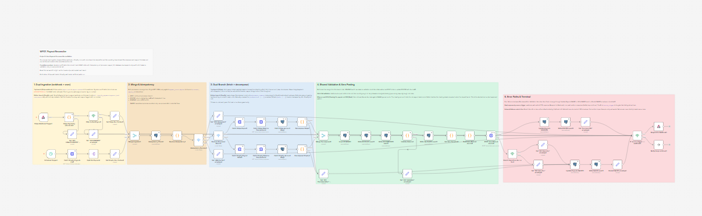
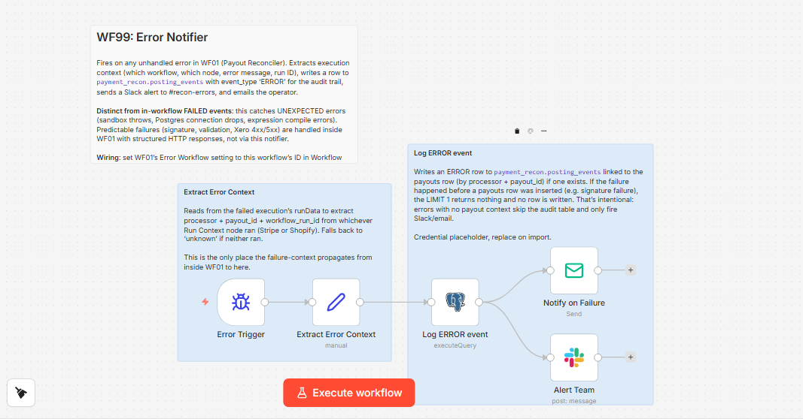
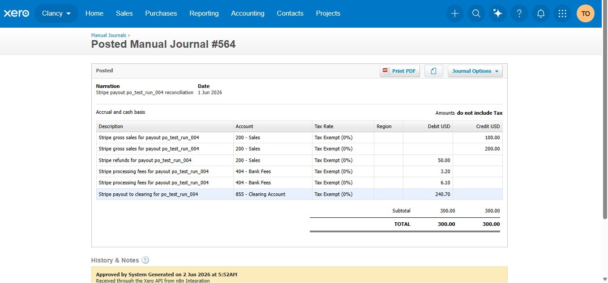
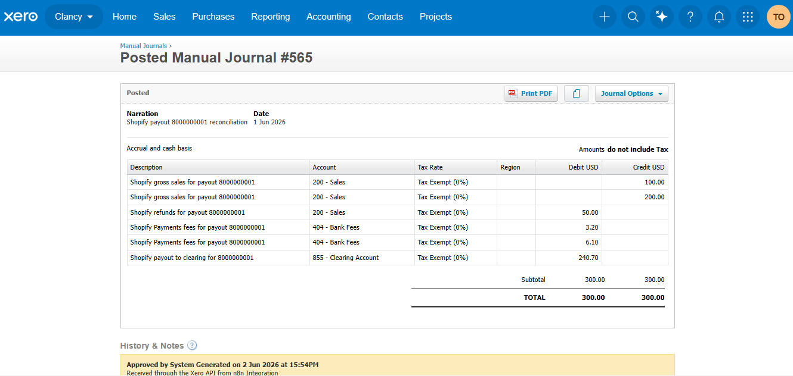
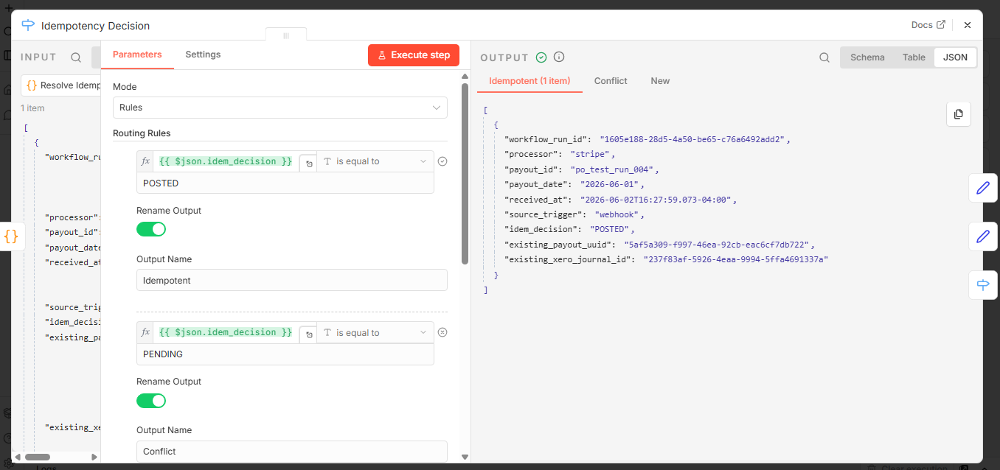
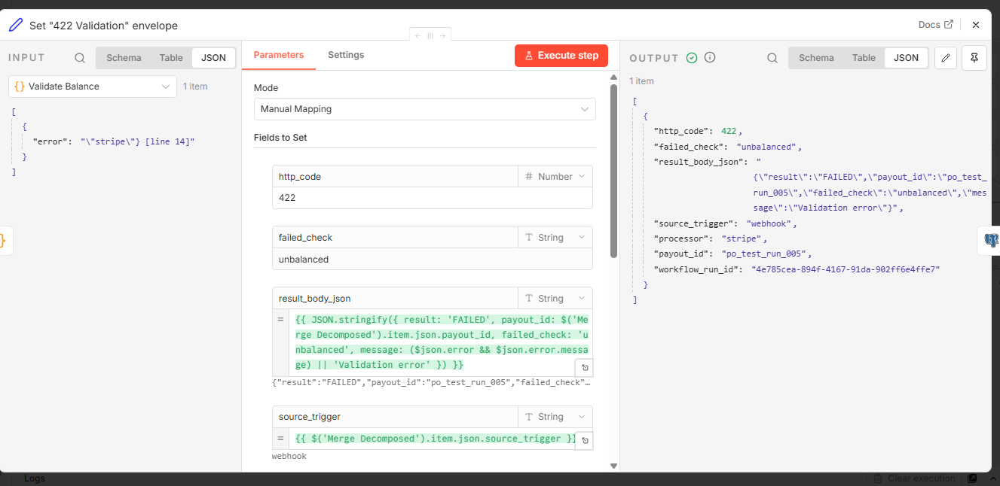
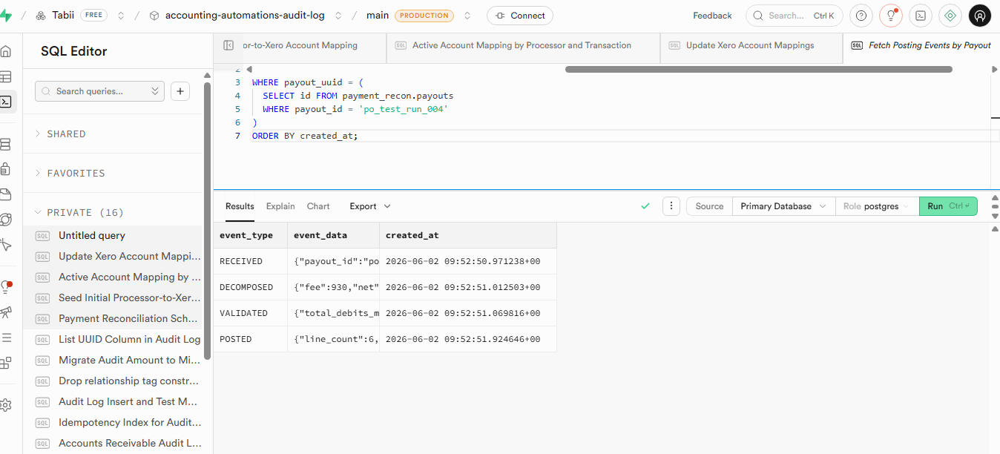
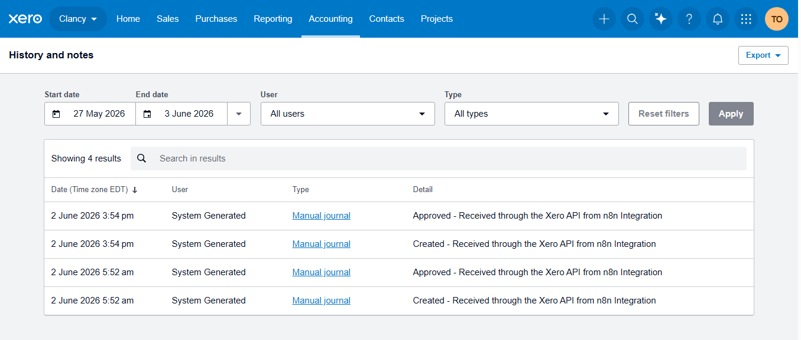

# Xero Payment Processor Reconciliation

**Built for SMB founders and bookkeepers who lose Sunday afternoons matching Stripe and Shopify deposits to orders.**

Status: Shipped. Tested end-to-end against a live Xero demo company and live Stripe test webhooks. Six execution paths verified. Real journals posted, real audit trail, real failure modes exercised. [Skip to the evidence](#what-actually-runs).

---

## The problem this solves

Stripe pays you $4,217.83 on Tuesday. Your bank shows it. Xero shows it. Now you have to figure out: what is that $4,217.83?

It is the net of forty-three payments from Monday, minus three refunds, minus the processing fees, minus a couple of adjustments. The same deposit could be 47 orders, or 412 orders, depending on how busy you were. None of the underlying transactions show up in your bank feed. They show up in Stripe's dashboard, broken out across screens you have to click through one at a time.

So you (or your bookkeeper) open Stripe, download the payout report, open Shopify, download the order summary, open a spreadsheet, line them up, calculate the net, and write a manual journal in Xero that records the revenue, the refunds, the fees, and the deposit. Then you do it again next Tuesday. And the Tuesday after that. The whole thing takes a couple of hours per processor per week, and that is before anything goes wrong.

The numbers are unkind. A survey of 1,200 accounting professionals found 76% spend more than 15 hours per month on bank reconciliation, with 34% working past midnight during month-end close. For e-commerce specifically, this is rated the biggest point of failure in accounting, "practically impossible once you start to scale." Manual reconciliation error rates run 10 to 15% on initial matching, and undetected errors flow into financial statements in roughly a third of audits.

Bigger companies pay for A2X or Link My Books. Those are good products. They also assume you only need Stripe-to-QuickBooks or Shopify-to-Xero in a fixed shape, and they charge per transaction. If you have a custom chart of accounts, a custom revenue recognition convention, or two processors at once, you either contort to their model or you keep doing it manually.

That is what this builds: a reconciler that handles Stripe and Shopify payouts in the same workflow, posts to Xero as a properly structured Manual Journal, and writes every decision to an immutable audit log. The chart of accounts mapping lives in a config table you (or your accountant) can edit. The decomposition logic is in plain JavaScript you can read.

---

## What it does, in one sentence

When a Stripe or Shopify payout lands, the system fetches the underlying balance transactions, decomposes the lump sum into sales, refunds, fees, and the net deposit, posts a balanced Manual Journal to Xero, and writes every step to an append-only audit trail.

## What it does not do

It does not match the bank deposit to the journal automatically. Xero's bank reconciliation screen does that, manually or with a rule, after the journal is posted to the clearing account. This is by design: bank rec is where a human eyeballs the cleared deposit against the journal one more time before signing off.

It does not handle non-Shopify-Payments storefronts on Shopify (PayPal, Stripe Connect for Shopify, Bogus Gateway). Those are different payout shapes that need different decomposers. v1 is for merchants on Shopify Payments, which is the native processor most stores use.

It does not handle multi-currency yet. USD only in v1. Multi-currency adds FX rate handling and revaluation logic that earns its own scope.

It does not adjust prior periods. Once a journal is POSTED to Xero, the system never silently rewrites it. Adjustments are new journals on new dates, with clear references to the original. This is what an accountant means by an audit trail.

The discipline is deliberate. Reconciliation automation that quietly does too much is how you end up explaining to your accountant why six weeks of revenue is in the wrong account.

---

## How it works

Two workflows. The main reconciler runs on a single canvas with two ingestion shapes feeding a shared posting backbone. The error notifier catches anything unhandled.

**Workflow 01: Payout Reconciler.** One canvas, 48 functional nodes plus six section sticky notes. The top branch is Stripe via webhook (`payout.paid` and `payout.updated` events filtered to `status=paid`). The bottom branch is Shopify via daily cron (Shopify Payments has no payout webhook topic, so the workflow polls `GET /shopify_payments/payouts.json?status=paid` with a three-day lookback). Both branches feed a shared idempotency check, processor-specific fetch and decompose, then a shared validate-and-post chain that builds the Xero Manual Journal and POSTs it.



*WF01 canvas with section banners. Read left to right: Dual Ingestion (Stripe webhook + Shopify cron), Merge & Idempotency, Dual Branches (fetch + decompose), Shared Validation & Xero Posting, Error Paths & Terminal.*

**Workflow 99: Error Notifier.** Fires on any unhandled error in WF01. Extracts the failed execution context (which node, error message, processor, payout ID, workflow run ID), writes a row to `payment_recon.posting_events` with `event_type = 'ERROR'`, sends a Slack alert to `#recon-errors`, and emails the operator. This catches unexpected failures (sandbox throws, Postgres connection drops, expression compile errors) that the in-workflow FAILED chain cannot anticipate.



*WF99: structured error capture with audit trail integration. Wired to WF01 via the n8n Error Workflow setting.*

The dual-processor architecture is the part that matters. Each processor has its own fetch and decompose nodes, but they merge into a single shared posting backbone. That means the validation logic, the Xero builder, the audit log writes, and the failure handling are all written once. Adding a third processor in v2 (PayPal, Square, Wise) is a new branch on the ingestion side and a new row in the account_map table; nothing on the posting side has to change.

---

## Compliance controls baked in

This is where ACA training shows up. Seven controls, every one named with what it does and where it lives.

**1. Idempotency guard.** Unique index on `(processor, payout_id)` in the payouts table. The first thing the workflow does after merge is a LEFT JOIN lookup. If the payout has already been POSTED, the workflow returns HTTP 200 with the original Xero JournalID and `idempotent: true`. No duplicate journals. If it is PENDING (mid-flight), returns HTTP 409 Conflict. If it is FAILED, allows reprocess (because Xero might have been the problem and the retry should be allowed). New payouts continue to the processor branch.

**2. Append-only audit log.** Two tables: `payment_recon.payouts` (one row per payout) and `payment_recon.posting_events` (state transitions per payout). Both tables have Postgres triggers that block DELETE entirely and block UPDATE on identity fields. Status progression is allowed (PENDING to POSTED, PENDING to FAILED), but no row can be retroactively rewritten. A finance auditor asking "can rows be modified after creation?" gets an answer they can verify in SQL.

**3. Strict-fail balance validation.** Before any journal posts to Xero, the workflow sums all decomposed lines and confirms total debits equal total credits to the cent. No rounding plug, no $0.01 tolerance. Any imbalance is treated as a real signal (missing transaction type, wrong account map, sign convention bug, integer overflow), not noise to be smoothed over. Unbalanced journals route to the FAILED chain with `failed_check: 'unbalanced'`.

**4. Structural webhook verification with HMAC deferred to production.** The Stripe webhook signature is structurally verified (header present, well-formed with `t` and `v1` components, body matches the Stripe event envelope shape). Full HMAC-SHA256 verification is deferred to production deployment because n8n's Code-node sandbox blocks `require('crypto')` and the webhook handler delivers the body already parsed (the byte-exact raw bytes Stripe signed are not recoverable in this environment). The deferral is honest and documented; the production deployment will restore HMAC via the n8n Crypto node once raw-body access is available. This is what compliance-aware looks like when you cannot ship the perfect version on day one.

**5. Live account map fetch per run.** The chart of accounts mapping (which transaction type goes to which Xero account code, debit or credit, what the line description template looks like) lives in `payment_recon.account_map` and is queried fresh at the start of every decomposition. Cached maps would fail when a client renumbers their Xero accounts; live fetch costs maybe 30 milliseconds and is always correct.

**6. Retry configuration on every external call.** Every node that talks to Stripe, Shopify, Xero, or Supabase has `retryOnFail: true`, `maxTries: 3`, `waitBetweenTries: 2000`. Transient network failures don't fail the workflow; they retry transparently. Retry-exhausted failures route through the FAILED chain with full context.

**7. Structured error responses with HTTP status differentiation.** Every executable path terminates with a defined response. The Branch Xero Error 4xx vs 5xx node looks at the HTTP code Xero returned: 4xx-range responses (validation errors, expired tokens, bad tenant) route to a 422 envelope; 5xx-range responses or missing httpCode (network drops, n8n credential lookup failures) route to a 502 envelope. The webhook caller gets an actionable HTTP status, not a generic 500. The audit log captures the specific failure reason in the `failed_check` column.

The control set is what makes this defensible to your accountant. Not the n8n graph, not the Xero integration; the seven controls.

---

## What actually runs

Six execution paths tested end-to-end against Clancy (the Xero demo company) with live Stripe webhook delivery and synthetic Shopify cron data pinned to the workflow nodes. All six passed. Screenshots below are live evidence captured during the test runs, not staged.

### Path 1: Stripe happy path (auto-post)

A Stripe `payout.paid` event arrives. Signature is structurally verified, the filter confirms `object: payout` and `status: paid`, the idempotency check finds no existing row, the workflow fetches the payout detail and balance transactions, decomposes into six journal lines (two payment credits to Sales, one refund debit to Sales, two fee debits to Bank Fees, one payout debit to Clearing), validates that debits equal credits to the cent, posts the Manual Journal to Xero, captures the returned JournalID, writes the POSTED audit row, and returns HTTP 200 to Stripe. Total time: 1.4 seconds.



*Xero Manual Journal #564 posted by the Stripe path. Six balanced lines totaling $300 debits and $300 credits. Status: Posted. Approved by System Generated via the n8n integration.*

### Path 2: Shopify happy path (auto-post)

The Shopify cron fires. The workflow lists payouts with `status=paid`, splits the list into individual payouts, fetches each payout's balance transactions, decomposes into six journal lines (same structure as Stripe), validates, posts to Xero, audits, and exits via NoOp (no HTTP response because cron path has no caller). Same shape as Path 1, different ingestion. The cron path is the one most production deployments will run; the webhook path is for Stripe.



*Xero Manual Journal #565 posted by the Shopify path. Same structure, different processor label, same $300 = $300 balance. One workflow, two ingestion shapes, one normalized journal.*

### Path 3: Idempotent retry

The Stripe webhook for `po_test_run_004` is replayed (same payload as Path 1). The idempotency check finds the existing POSTED row, returns the original Xero JournalID with `idempotent: true`, and short-circuits the workflow. No second journal is posted to Xero, no new audit rows are written. The webhook responds 200 with the original Journal ID so the caller knows the work was already done.



*Idempotency Decision output. idem_decision: POSTED, existing_xero_journal_id returned from the audit table. Routes to the 200 Idempotent envelope, never hits Xero.*

### Path 4: Unbalanced decomposition

A Stripe payout (`po_test_run_005`) is replayed with a tampered fixture: the second payment amount is $5 short of what it should be. The decomposition produces six lines that don't balance ($295 credits versus $300 debits). The Validate Balance node throws with the imbalance details. The FAILED chain runs: Update Payouts FAILED writes status FAILED with `failed_check: 'unbalanced'`, Write FAILED event logs the audit row, Respond to Webhook returns HTTP 422 with the structured failure body.



*The 422 Validation envelope captures the failure reason (unbalanced), the workflow_run_id, the payout context, and the structured response body. No journal posted to Xero. Audit row written with the specific check that failed.*

### Path 5: Malformed signature header

A Stripe webhook arrives with a deliberately garbled `Stripe-Signature` header (no `t=` or `v1=` components). The Sig Verify node throws on the missing-component check. Error output routes to the 401 UNAUTHORIZED envelope. HTTP 401 returned to the caller. No idempotency check, no fetch, no Xero call, no audit row (because nothing about this request was identifiable as a legitimate payout). The control point exists and fires.

### Path 6: Xero credential unavailable

A Stripe webhook arrives with valid signature and valid payload. The workflow passes idempotency, fetches Stripe data, decomposes, validates. POST Xero fails because the Xero OAuth credential has been disconnected. The error output captures the failure, the Branch Xero Error 4xx vs 5xx node routes it to the 502 envelope (because the failure is at the n8n layer before Xero saw the request, this is treated as a 5xx/network-level failure). Update Payouts FAILED writes status FAILED with `failed_check: 'xero_5xx'`. HTTP 502 returned to the caller. WF99 fires and sends Slack and email alerts.

The audit trail in Supabase, showing every state transition for Path 1:



*Four chronological events for a single payout, all linked by `payout_uuid`. The audit log proves what the system saw, what it decided, and when. No row can be modified or deleted after creation; database-level enforcement, not application convention.*

The Xero history view for the demo company, showing both journals posted by the n8n integration across multiple test runs:



*Xero's own activity log records every journal Created and Approved by the n8n Integration, with timestamps. Independent proof, captured from Xero's UI, not from the workflow.*

---

## Engineering decisions worth highlighting

A few decisions in this build that are not obvious from the graph but worth explaining if you are evaluating whether to work with me.

**Clearing account, not bank account, for the payout line.** The first version of the account map sent the net payout line to account 090 (Business Bank Account). Xero rejected the journal with `Account code '090' is not a valid code for this document.` This is intentional Xero behaviour: Manual Journals cannot post to BANK-type accounts, because bank movements should tie to actual bank feed lines, not free-form journals. The right answer is the standard accountant pattern: the journal posts to account 855 (Clearing Account), and when the actual bank deposit lands, Xero's bank reconciliation screen matches the deposit to the clearing balance. This is not a workaround for Xero's restriction. It is the correct accounting model, because there are two real moments in time (Stripe says "payout sent" at T1, the bank actually credits the account at T2), and the clearing account holds the value in between. Discovering this rule the hard way is exactly the kind of domain knowledge that makes the case study credible.

**Live account map fetched per run, not cached.** Same principle as the AP Invoice Orchestrator. The decomposer queries `payment_recon.account_map` at the start of every payout processing run. If an accountant or bookkeeper renumbers a Xero account, or changes which Xero account a Stripe fee should map to, the next workflow run uses the new mapping. A cached map would mispost silently until someone noticed.

**Structural signature verification, with cryptographic verification clearly deferred.** n8n's Code-node sandbox blocks `require('crypto')` and `require('node:crypto')` outright. The webhook handler in n8n's version on this plan also delivers the body already parsed to JSON, which means the exact bytes Stripe signed are not recoverable. Cryptographic HMAC verification needs the raw body, which needs either a plan tier upgrade or a self-host configuration. Rather than fake the HMAC check with weaker logic, the workflow verifies what it can verify (header shape, event envelope shape) and documents the limitation honestly in code and in the case study. When the production deployment has raw-body access, restoring HMAC is a single Crypto node and a single comparison. The structural check is not a substitute for HMAC; it is a proof point that the control gate is wired and the deferral is named.

**Decomposer reads the live account_map, not hardcoded constants.** The Stripe and Shopify decomposers each look up the transaction type in the account_map fetched seconds earlier. This means adding a new transaction type (a new Shopify adjustment subtype, a new Stripe balance transaction type) is one INSERT statement in Supabase, not a code change. The decomposer throws loudly on any unmapped type, so missing seed data surfaces at first encounter rather than failing silently.

**Strict-fail validation, no rounding plug.** A common pattern in reconciliation automation is to allow a $0.01 tolerance on the balance check, "because rounding." This system refuses to do that. If debits do not equal credits to the cent, something is wrong: a missing transaction type, a sign convention bug, an integer overflow, a fixture mismatch. The right answer is to find the bug, not absorb the difference into a rounding account that quietly accumulates errors over months. The discipline is harder; it is also what makes this defensible to an accountant who has seen too many systems with "rounding plugs" that ended up holding thousands of dollars of misposted entries by year-end.

**Dual response by source_trigger.** One workflow handles both webhook and cron ingestion, but the response shape is different: webhook returns HTTP, cron returns no response (a NoOp loop continue). The terminal IF on `source_trigger` is the gate. This is the smallest piece of wiring that keeps the workflow honest about which caller it is talking to.

---

## What's deferred to v2

Honest about this list, because vendors who promise everything are the ones SMB buyers learn to distrust.

- **Multi-currency.** USD only in v1. Multi-currency adds FX rate handling, revaluation logic at posting, and per-currency clearing accounts in Xero.
- **Real cryptographic HMAC on the Stripe webhook.** Deferred for the n8n sandbox and plan-tier reason explained above. Restored at production deployment via the Crypto node.
- **Auto bank reconciliation match.** v1 posts to clearing; the human matches the bank feed line to the clearing balance in Xero's bank rec screen. v2 could call Xero's bank reconciliation API to do this automatically.
- **PayPal, Square, Wise.** v1 covers Stripe and Shopify Payments. Adding a third processor is a new ingestion branch and a new row in the account_map. The shared posting backbone is reused.
- **Multi-tenant Xero setup.** The tenant ID is centralized in one Set node but still hardcoded. A multi-tenant deployment (one workflow serving multiple Xero organizations) would move tenant ID into a per-client config table.
- **Reporting dashboard.** v1 reporting is SQL queries against the audit log. A dashboard showing reconciliation completeness, average decomposition time, failure rate by processor, and outstanding clearing balance is worth building once there is enough audit data to make trends meaningful.

---

## The stack

n8n self-hosted or Cloud as the workflow engine. The workflow is portable; the only environment-specific values are credentials and the tenant ID.

Supabase for the audit log. Three tables in the `payment_recon` schema: `payouts` (idempotency plus summary), `posting_events` (state transitions), `account_map` (per-processor transaction type to Xero account code mapping). Append-only enforcement via Postgres triggers.

Stripe webhook for the push trigger. The signature header is structurally verified in v1, cryptographically verified in production. Stripe API for fetching payout detail and balance transactions.

Shopify Admin API for the cron-driven poll. `GET /shopify_payments/payouts.json` and `GET /shopify_payments/balance/transactions.json`. The cron runs daily at 06:00 UTC with a three-day lookback.

Xero Accounting API via generic OAuth2 (not the native n8n Xero node, because the native node does not expose Manual Journals cleanly). Scopes: `accounting.manualjournals offline_access` minimum. The journal posts as a Xero Manual Journal with `Status: POSTED`.

Slack and email for the error notifier.

The full source is in this folder:

```
xero-payment-processor-reconciliation/
├── workflows/
│   ├── 01-payout-reconciler.json
│   └── 99-error-notifier.json
├── sql/
│   ├── 001_schema.sql
│   └── 002_seed_account_map.sql
├── samples/
│   ├── 01-fixture-stripe-happy.json
│   ├── 02-fixture-shopify-happy.json
│   ├── 04-fixture-unbalanced.json
│   └── 06-fixture-xero-failure.json
├── screenshots/
└── README.md  (this file)
```

To run this against your own Xero demo company: import the two workflow JSON files into n8n, run the SQL files against a Supabase Postgres instance, wire your Stripe webhook, Shopify Admin API token, Xero OAuth2 credential, and Supabase Postgres credential. Update the tenant ID in the Set Xero Tenant Id node. Trigger the orchestrator with one of the sample payloads or by replaying a real Stripe `payout.paid` event from a test account configured for automatic payouts.

---

## What this would cost to run for you

The honest answer depends on the shape of your e-commerce, but here are the variables:

**Payout volume.** A small business processing one to three payouts per week per processor is well within free or starter tiers across the stack.

**n8n hosting.** Self-hosted on a small VPS is $5 to $15/month. n8n Cloud is $20/month for the starter plan.

**Supabase.** Free tier covers an SMB audit log comfortably. Pro tier ($25/month) if you want backups and longer retention.

**The build itself.** Fixed-price pilot for a single customer engagement, typical range $2,000 to $6,000 depending on the number of processors, the Xero chart of accounts shape, and whether you need multi-tenant or multi-currency on day one.

Total ongoing infrastructure: $25 to $70/month, depending on volume. Compare against the time you (or your bookkeeper) currently spend on payout reconciliation and the math is straightforward.

---

## Working together

If you are an SMB founder running e-commerce, a fractional CFO with two or more clients that take Stripe or Shopify payouts, or a bookkeeper running reconciliation for SMB clients, and the workflow above looks like it would save you a Sunday per month, the fastest way to know if I am the right person to build this for you is a 30-minute scoping call.

I will map your payment-to-ledger process on the call, tell you whether automation is the right answer, and quote a fixed price if it is. If it is not the right fit, I will say so.

- **Upwork:** [tabitha-eoke on Upwork](https://www.upwork.com/freelancers/~01954f73840469cae5)
- **LinkedIn:** [linkedin.com/in/tabitha-oke-n8n](https://www.linkedin.com/in/tabitha-oke-n8n)
- **Email:** tabithaeoke@gmail.com

I respond within one business day.

---

*Built by Tabitha Oke, ACA. Workflows are MIT-licensed as portfolio pieces. Production deployment in a client engagement requires a direct engagement.*
